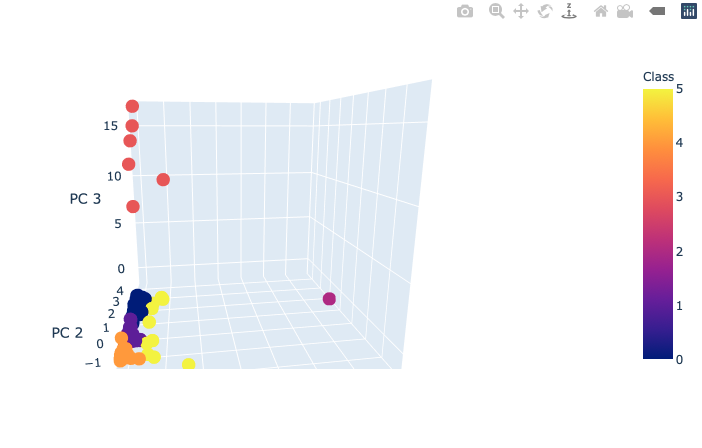
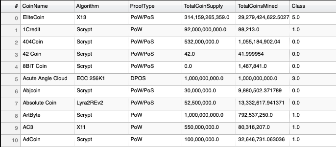
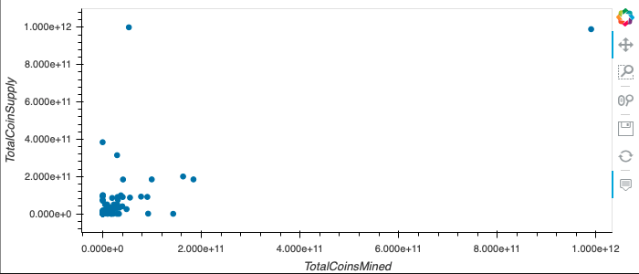

# Clustering Crypto

## Technologies Used

* [Python](https://www.python.org)
* [Pandas](https://pandas.pydata.org)
* [matplotlib](https://matplotlib.org)
* [hvPlot](https://hvplot.holoviz.org)
* [plotly](https://plotly.com)
* [scikit-learn](https://scikit-learn.org/stable/) - [PCA](https://scikit-learn.org/stable/modules/generated/sklearn.decomposition.PCA.html), [k-means](https://scikit-learn.org/stable/modules/clustering.html#k-means)

## Elbow Curve

## 3D Scatterplot - Crypto Classification

## Hvplot Table - Crypto Attributes

## Crypto Scatterplot

